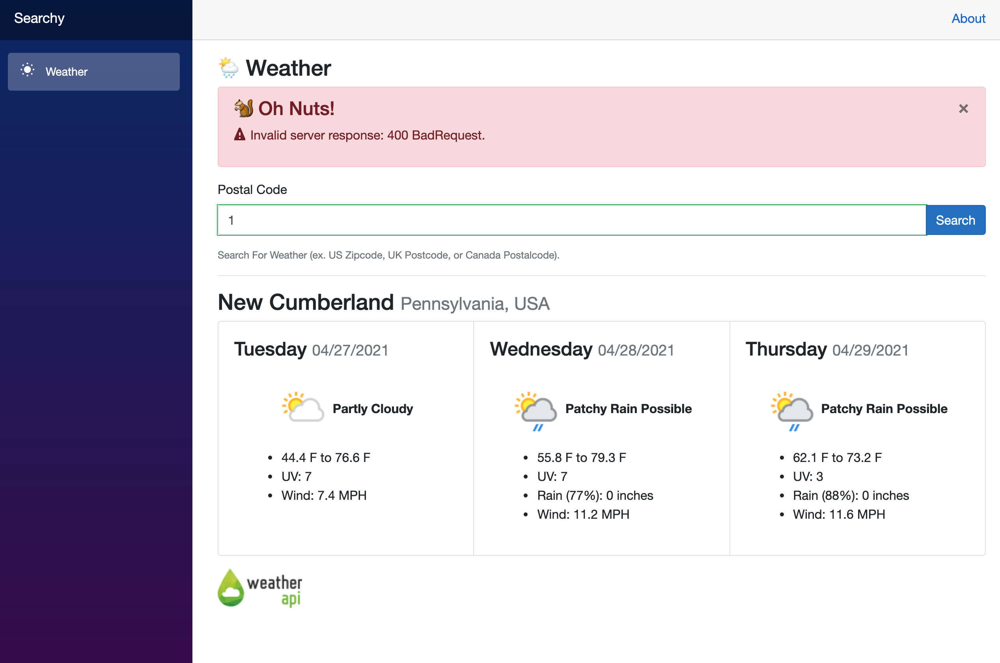

## Weather Search

I wrote this Blazor application to learn more about the framework. This example uses [WeatherAPI](https://www.weatherapi.com/) and an alpha NuGet package. **If you want to use this in some production capacity, I suggest you build your own API wrapper, since the NuGet package is out of date with the current API.**

## Getting Started

1. Go to [WeatherAPI](https://www.weatherapi.com/) and sign up for a **Free** account. You'll need the API Key.
2. Change the `Weather:ApiKey` setting in `appsettings.json` (or use user secrets).
3. Run the application

## Notable Blazor Features &amp; Techniques

1. Use of `EditForm`, a wrapper around an HTML form with convenience extensions.
1. `DataAnnotationsValidator` component to trigger validation.
1. Validation model using `DataAnnotations`
1. Using `CancellationTokenSource` to timeout web request that's taking too long.

## Suggestions

In the WeatherAPI account page, you may want to uncheck `Astro` response fields if you intend to use the `WeatherAPI` NuGet package along with the most recent API. There is a mismatch which causes a deserialization error.

## Thanks

Be sure to follow me on Twitter ([@buhakmeh](https://twitter.com/buhakmeh)) and feel free to ask any questions.

